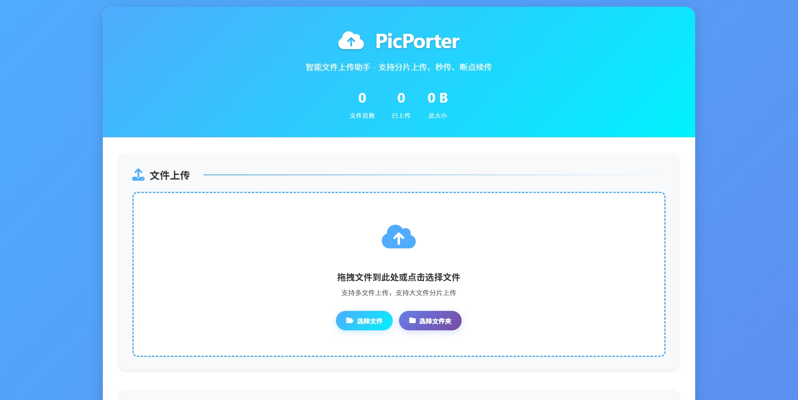
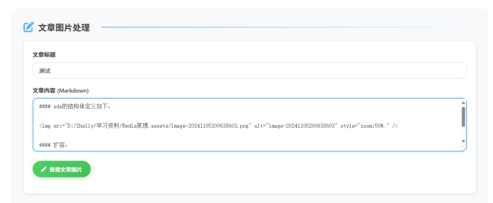
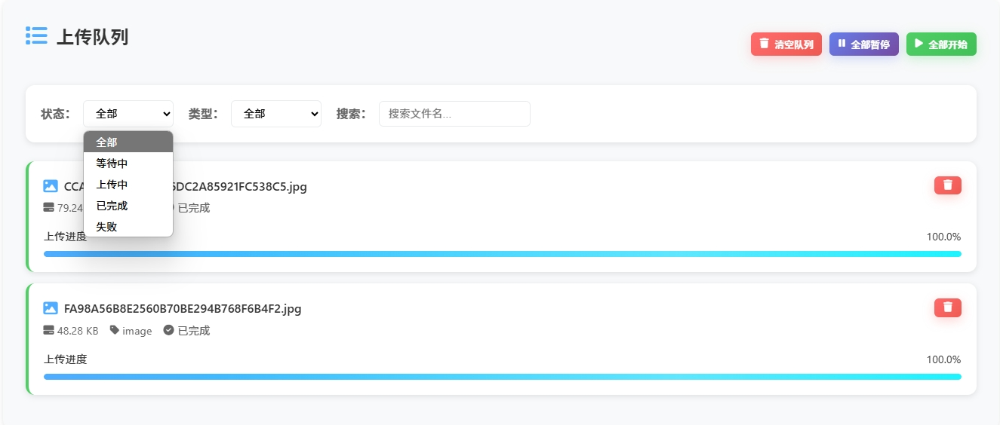
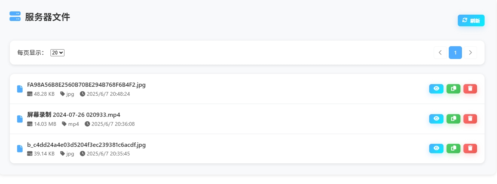
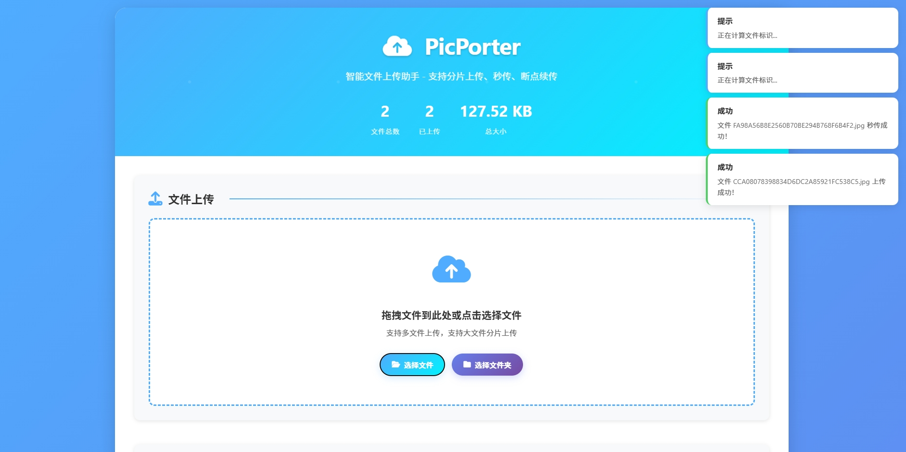

# 🚀 PicPorter - 智能文件上传助手

[](https://www.oracle.com/java/)
[](https://spring.io/projects/spring-boot)
[](https://www.mysql.com/)
[](LICENSE)

> 基于 Spring Boot 的现代化文件上传解决方案，支持分片上传、秒传、断点续传，本地 Markdown 图片自动上传与链接替换，除此之外，还提供优雅的前端界面和完整的 API 服务。

## ✨ 功能特性

- 🎯 **智能上传策略** - 小文件直传，大文件自动分片
- ⚡ **秒传技术** - MD5 校验，相同文件瞬间完成
- 🔄 **断点续传** - 网络中断后继续上传，不重复传输
- 📁 **多存储支持** - 支持 MinIO 和阿里云 OSS
- 🖼️ **文章图片处理** - Markdown 文章图片自动上传替换
- 📱 **响应式界面** - 现代化 UI，完美适配各种设备
- 📚 **API 文档** - 集成 Swagger，提供完整 API 说明
- 🔍 **文件管理** - 支持预览、下载、删除等操作

## 🛠️ 技术栈

**后端技术:**
- Java 17+
- Spring Boot 3.0+
- MySQL 8.0+
- MyBatis Plus
- MinIO / 阿里云 OSS

**前端技术:**
- 原生 JavaScript (ES6+)
- CSS3 + CSS 变量
- Font Awesome 图标
- CryptoJS (MD5 计算)

## 🚀 快速开始

### 1. 环境要求

确保你的开发环境满足以下要求：

```bash
Java 17+
MySQL 8.0+
Maven 3.6+
Node.js (可选，用于前端开发)
```

### 2. 克隆项目

```bash
git clone https://github.com/ShlyxCoder/PicPorter.git
```

### 3. 数据库配置

#### 创建数据库
```sql
CREATE DATABASE picporter CHARACTER SET utf8mb4 COLLATE utf8mb4_unicode_ci;
```
##### 在docs目录下找到sql文件运行即可完成数据库配置
#### 配置连接信息
编辑 `src/main/resources/application.yml`：

```yaml
spring:
  datasource:
    url: jdbc:mysql://localhost:3306/picporter?serverTimezone=GMT%2B8&useUnicode=true&characterEncoding=utf-8
    username: your_username          # 替换为你的数据库用户名
    password: your_password          # 替换为你的数据库密码
    driver-class-name: com.mysql.cj.jdbc.Driver
```

### 4. 存储配置

#### 选择存储策略

**方式一：使用 MinIO (推荐开发环境)**

```yaml
upload:
  strategy: minio                    # 使用 MinIO
  minio:
    url: http://localhost:9000       # MinIO 服务地址
    access-key: minioadmin           # 访问密钥
    secret-key: minioadmin           # 密钥
    bucket-name: picporter           # 存储桶名称
```

**方式二：使用阿里云 OSS (推荐生产环境)**

```yaml
upload:
  strategy: oss                      # 使用阿里云 OSS
  oss:
    url: https://your-bucket.oss-cn-chengdu.aliyuncs.com/
    endpoint: oss-cn-chengdu.aliyuncs.com
    bucketName: your-bucket-name
    accessKeyId: your-access-key-id
    accesskeySecret: your-access-key-secret
```

#### MinIO 快速安装 (Docker)

```bash
# 拉取并运行 MinIO
docker run -d \
  --name minio \
  -p 9000:9000 \
  -p 9001:9001 \
  -e "MINIO_ROOT_USER=minioadmin" \
  -e "MINIO_ROOT_PASSWORD=minioadmin" \
  minio/minio server /data --console-address ":9001"

# 访问管理界面: http://localhost:9001
# 用户名: minioadmin
# 密码: minioadmin
```

创建存储桶：
1. 登录 MinIO 控制台
2. 点击 "Create Bucket"
3. 输入桶名称: `picporter`
4. 设置访问策略为 `public`

### 5. 启动应用

```bash
# 使用 Maven 启动
mvn spring-boot:run

# 或者编译后启动
mvn clean package
java -jar target/picporter.jar
```

应用启动后访问：
- **前端界面**: 在web目录下找到index.html即可打开
- **API 文档**: http://localhost:8080/swagger-ui.html
- **Knife4j 文档**: http://localhost:8080/doc.html

## ⚙️ 详细配置说明

### 完整配置文件

```yaml
server:
  port: 8080                         # 服务端口

spring:
  application:
    name: PicPorter
  servlet:
    multipart:
      max-file-size: 50MB            # 单个文件最大大小
      max-request-size: 50MB         # 请求最大大小
  datasource:
    url: jdbc:mysql://localhost:3306/picporter?serverTimezone=GMT%2B8&useUnicode=true&characterEncoding=utf-8
    username: <USERNAME>             # 数据库用户名
    password: <PASSWORD>             # 数据库密码
    driver-class-name: com.mysql.cj.jdbc.Driver

upload:
  prefix: article                    # 文件上传前缀
  strategy: oss                      # 存储策略: minio 或 oss
  is-stored: true                   # 是否存储到本地，需要配置数据库，建议为true，否则只能使用文章链接替换功能
  
  # MinIO 配置
  minio:
    url: <URL>                       # MinIO 服务地址
    access-key: <ACCESS-KEY>         # 访问密钥
    secret-key: <SECRET-KEY>         # 安全密钥
    bucket-name: <BUCKET-NAME>       # 存储桶名称
  
  # 阿里云 OSS 配置
  oss:
    url: https://EXAMPLE-BUCKET.oss-cn-chengdu.aliyuncs.com/
    endpoint: oss-cn-chengdu.aliyuncs.com
    bucketName: EXAMPLE-BUCKET
    accessKeyId: <ACCESS-KEY-ID>
    accesskeySecret: <ACCESS-KEY-SECRET>

# API 文档配置
springdoc:
  swagger-ui:
    path: /swagger-ui.html
  api-docs:
    path: /v3/api-docs

knife4j:
  enable: true
  setting:
    language: zh_cn
```

### 配置项说明

| 配置项 | 说明 | 默认值 | 必填 |
|-------|------|--------|------|
| `upload.strategy` | 存储策略 | `oss` | ✅ |
| `upload.prefix` | 文件前缀 | `article` | ❌ |
| `upload.minio.url` | MinIO 地址 | - | ⚠️ |
| `upload.oss.endpoint` | OSS 端点 | - | ⚠️ |
| `spring.servlet.multipart.max-file-size` | 最大文件大小 | `50MB` | ❌ |

⚠️ 根据选择的存储策略，相应配置为必填

## 📁 项目结构

```
PicPorter/
├── src/main/java/cn/org/shelly/picporter/
│   ├── controller/          # 控制器层
│   ├── service/            # 服务层  
│   ├── entity/             # 实体类
│   ├── config/             # 配置类
│   ├── utils/              # 工具类
│   └── strategy/           # 策略类
├── src/main/resources/
│   ├── application.yml     # 配置文件
│   └── static/            # 静态资源
├── web/
│   ├── modular/  # 模块化前端
│   └── portable/ # 单文件前端
└── docs/                   # 文档
```
## 📸 页面展示

### 🎨 主界面概览

现代化的渐变背景设计，简洁优雅的卡片式布局，为用户提供舒适的视觉体验。支持小文件上传、批量上传，文件夹上传、拖拽上传、分片上传、断点续传，相同文件秒传等操作。

**功能特点:**
- 🎯 **拖拽上传** - 直接拖拽文件到上传区域
- 📁 **多文件选择** - 支持批量选择文件
- 📂 **文件夹上传** - 一键上传整个文件夹
- ✨ **悬停效果** - 丰富的交互动画



---

### ✏️ 文章图片处理

Markdown 文章图片自动上传替换功能，让文章发布变得更加便捷。

**使用流程:**
1. 输入文章标题（可选）
2. 粘贴包含本地图片的 Markdown 内容，注意，这里有个细节：
   <br>
   （1）md文章先全部`ctrl+c`复制，新建一个空白的md，粘贴，再进行一次全文复制。
   <br>
   （2）请确保原md最后结束不是一张图片，若是，你可在图片后面写上任意文字（如结束）再进行（1）然后再删除即可。
4. 点击"处理文章图片"按钮
5. 系统自动上传图片并替换链接



---

### 📋 上传队列管理

实时显示上传进度，支持暂停、继续、删除等操作，让文件管理更加灵活。



**队列功能:**
- 📊 **实时进度** - 显示上传百分比和速度
- ⏸️ **暂停续传** - 随时暂停和继续上传
- 🌊 **流畅动画** - 渐变色进度条和闪烁效果
- 🎯 **状态标识** - 等待、上传中、已完成、失败状态
- 🔍 **智能过滤** - 按状态、类型、文件名筛选
- 🗑️ **批量操作** - 支持全部暂停、开始、清空

---

### 🗂️ 服务器文件管理

查看、预览、下载、删除服务器上的文件，提供完整的文件管理功能。



**管理功能:**
- 👁️ **在线预览** - 图片、PDF 等文件在线查看
- 📋 **一键复制** - 快速复制文件访问链接
- 🗑️ **安全删除** - 确认对话框防误删
- 📄 **分页浏览** - 支持分页和每页条数设置

---

### 🔔 智能通知系统

实时通知系统，及时反馈操作结果。



**通知类型:**
- ✅ **成功通知** - 绿色边框，操作成功提示
- ❌ **错误通知** - 红色边框，错误信息显示
- ⚠️ **警告通知** - 黄色边框，警告信息提醒
- ℹ️ **信息通知** - 蓝色边框，一般信息提示

---

## 🐛 常见问题

### 1. 文件上传失败

**问题**: 文件上传时报错 "文件过大"  
**解决**: 检查 `max-file-size` 配置，确保足够大
<br>
**问题**: 文件上传失败
<br>
**解决**: 检查图床配置是否正确，策略配置是否正确

### 2. 数据库相关功能失败

**问题**: 数据库连接或提示错误  
**解决**:
- 确认 MySQL 服务已启动
- 检查用户名密码是否正确
- 确认数据库 `picporter` 已创建
- 检查配置 `is-stored` 是否为true

### 3. 功能未实现问题

**问题**: 提示"功能未实现" 相关问题
<br>
**解决**: 目前Minio相关功能全部实现，OSS目前暂未实现大文件分片功能，其他功能均已实现


## 📄 开源协议

本项目基于 [MIT](LICENSE) 协议开源。

## 🌟 Star History

如果这个项目对你有帮助，请给个 ⭐ Star 支持一下！

